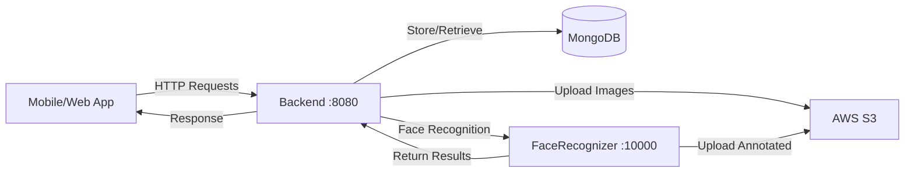

# AttendanceSystemBackend - AI Attendance System Backend

A comprehensive backend system for AI-powered attendance management, consisting of a Node.js REST API and a Python-based face recognition service.

## 🏗️ System Architecture

This system consists of **two main services** that work together:

```
AttendanceSystemBackend/
├── Backend/              # Node.js Express REST API
│   └── README.md        # Detailed setup and API documentation
├── FaceRecognizer/       # Python FastAPI Face Recognition Service
│   └── README.md        # Detailed setup and configuration
├── docker-compose.yml    # Docker orchestration
└── API_Documentation.txt # Complete API reference
```

### 📚 Detailed Documentation

For detailed setup and configuration instructions, please refer to the individual service READMEs:

- **[Backend Documentation](./Backend/README.md)** - Node.js REST API service
- **[FaceRecognizer Documentation](./FaceRecognizer/README.md)** - Python face recognition service

## 📖 Quick Overview

### Backend (Node.js)
The Backend service handles all business logic, authentication, and data management.

**Key Features:**
- JWT authentication with role-based access control
- Multi-organization and department management
- Complete CRUD operations for all entities
- AWS S3 integration for image storage
- MongoDB database with Mongoose ODM

**Technology:** Node.js, Express.js, MongoDB, AWS S3, JWT

**Port:** 8080

👉 **[View Backend Documentation](./Backend/README.md)**

---

###  FaceRecognizer (Python)
The FaceRecognizer service provides AI-powered face detection and recognition.

**Key Features:**
- Face detection using InsightFace
- Face embedding generation (512 dimensions)
- Batch image processing
- GPU acceleration support (CUDA)
- Annotated image generation

**Technology:** Python, FastAPI, InsightFace, OpenCV, CUDA (optional)

**Port:** 10000

👉 **[View FaceRecognizer Documentation](./FaceRecognizer/README.md)**

---

## ⚡ Quick Start

### Prerequisites

- **Node.js** 16+ (for Backend)
- **Python** 3.8+ (for FaceRecognizer)
- **MongoDB** 4.4+ (local or Atlas)
- **AWS Account** (S3 bucket)
- **CUDA** (optional, for GPU acceleration)

### 1. Backend Setup

```bash
cd Backend
npm install
# Configure .env (see Backend/README.md)
node seed.js  # Seed database with test data
npm run dev   # Start on port 8080
```

📖 **[Detailed Backend Setup Guide](./Backend/README.md#-installation)**

### 2. FaceRecognizer Setup

```bash
cd FaceRecognizer
python -m venv venv
source venv/bin/activate  # Windows: venv\Scripts\activate
pip install -r requirements.txt
# Configure .env (see FaceRecognizer/README.md)
uvicorn main:app --port 10000 --reload
```

📖 **[Detailed FaceRecognizer Setup Guide](./FaceRecognizer/README.md#-installation)**

## 🔑 Default Login Credentials

After running the database seed script (`node Backend/seed.js`), use these credentials:

| Role | Email | Password |
|------|-------|----------|
| System Admin | `admin@system.com` | `password123` |
| Org Admin | `admin@tech-u.com` | `password123` |
| Dept Admin | `head@computerscience.com` | `password123` |
| Faculty | `faculty@computerscience.com` | `password123` |

> **⚠️ Important:** Change these credentials before deploying to production.

## 📁 Service Communication

The Backend service communicates with the FaceRecognizer service for:

1. **Student Registration**: Generates face embeddings from student photos
2. **Attendance Verification**: Identifies students in classroom images
3. **Image Annotation**: Creates marked images with bounding boxes

**Default Configuration:**
- Backend → FaceRecognizer: `http://localhost:10000`

## 🔄 Data Flow



## 📊 Environment Variables

Both services require environment variables. Create `.env` files in each service directory:

### Backend/.env
```env
NODE_ENV=development
MONGODB_URL=mongodb://localhost:27017/AI_Attendance_System
JWT_SECRET=your-secret-key
AWS_ACCESS_KEY_ID=your-key
AWS_SECRET_ACCESS_KEY=your-secret
AWS_REGION=ap-south-1
AWS_BUCKET_NAME=your-bucket
FACE_RECOGNIZER_URL=http://localhost:10000
```

📖 **[Complete Backend Environment Variables](./Backend/README.md#-environment-variables)**

### FaceRecognizer/.env
```env
AWS_ACCESS_KEY_ID=your-key
AWS_SECRET_ACCESS_KEY=your-secret
AWS_REGION=ap-south-1
AWS_BUCKET_NAME=your-bucket
```

📖 **[Complete FaceRecognizer Environment Variables](./FaceRecognizer/README.md#-environment-variables)**

## 🔌 API Reference

Complete API documentation with examples is available in **[API_Documentation.txt](./API_Documentation.txt)**.

### Key Endpoints

**Backend (Port 8080):**
- `POST /auth/login` - User authentication
- `GET/POST /organisation` - Organization management
- `GET/POST /department` - Department management
- `GET/POST /subject` - Subject management
- `GET/POST /student` - Student management
- `GET/POST /lecture` - Lecture and attendance

**FaceRecognizer (Port 10000):**
- `POST /generate-embeddings` - Create face embeddings
- `POST /verify-attendance` - Process attendance
- `POST /verify-attendance/dry-run` - Test mode

## 🧪 Testing the Setup

### 1. Verify Backend
```bash
curl http://localhost:8080/
# Expected: {"type":"success","message":"Server is running"}
```

### 2. Verify FaceRecognizer
```bash
curl http://localhost:10000/
# Expected: {"message":"Welcome to Presentify Face Recognition API"}
```

### 3. Test Login
```bash
curl -X POST http://localhost:8080/auth/login \
  -H "Content-Type: application/json" \
  -d '{"email":"admin@system.com","password":"password123"}'
```

## 🐛 Common Issues

### Backend Issues
- **MongoDB connection**: Ensure MongoDB is running
- **Port 8080 in use**: Kill existing process or change port
- **AWS S3 upload fails**: Check credentials and bucket permissions

👉 **[Backend Troubleshooting Guide](./Backend/README.md#-troubleshooting)**

### FaceRecognizer Issues
- **CUDA not found**: Install CUDA Toolkit or use CPU mode
- **Model download**: Requires internet on first run
- **Port 10000 in use**: Kill existing process or change port

👉 **[FaceRecognizer Troubleshooting Guide](./FaceRecognizer/README.md#-troubleshooting)**

## 🚀 Development Workflow

1. **Start MongoDB**: `sudo systemctl start mongod` (Linux) or equivalent
2. **Start Backend**: `cd Backend && npm run dev`
3. **Start FaceRecognizer**: `cd FaceRecognizer && uvicorn main:app --reload --port 10000`
4. **Access APIs**: 
   - Backend: http://localhost:8080
   - FaceRecognizer: http://localhost:10000

## 📚 Documentation Links

- **[Backend README](./Backend/README.md)** - Complete Backend setup and API details
- **[FaceRecognizer README](./FaceRecognizer/README.md)** - Complete FaceRecognizer setup and configuration
- **[API Documentation](./API_Documentation.txt)** - Full API reference with examples

## 🔒 Security Notes

> **Production Deployment:**
> - Change all default passwords
> - Use strong JWT_SECRET (minimum 32 characters)
> - Enable HTTPS/SSL
> - Restrict CORS to specific domains
> - Use environment-specific `.env` files
> - Never commit `.env` files to version control
> - Regularly update dependencies
> - Implement rate limiting
> - Monitor and log all activities

## 📄 License

**Copyright © 2025. All Rights Reserved.**

This software and its associated documentation are proprietary and confidential. Unauthorized copying, distribution, modification, or use of this software, via any medium, is strictly prohibited without explicit written permission from the copyright holder.

### Proprietary Notice

This is proprietary software. The source code, design, architecture, and all associated materials are the exclusive property of the copyright holder. No license, right, or interest in the software is granted except as expressly set forth in a written agreement signed by the copyright holder.

### Restrictions

- **No Reproduction**: You may not copy, reproduce, or duplicate any part of this software.
- **No Distribution**: You may not distribute, share, or transfer this software to any third party.
- **No Modification**: You may not modify, adapt, or create derivative works based on this software.
- **No Commercial Use**: You may not use this software for commercial purposes without explicit written permission.
- **No Reverse Engineering**: You may not reverse engineer, decompile, or disassemble this software.

### Permission Required

To obtain permission to use, modify, or distribute this software, please contact the copyright holder in writing. Any use without explicit written permission will be considered a violation of intellectual property rights and may result in legal action.

## 🆘 Support

For issues and detailed troubleshooting:
- **[Backend Support](./Backend/README.md#-troubleshooting)**
- **[FaceRecognizer Support](./FaceRecognizer/README.md#-troubleshooting)**
- Review API documentation: [API_Documentation.txt](./API_Documentation.txt)

---

**System Version**: 1.0.0  
**Last Updated**: December 2025  
**Services**: Backend (Node.js) + FaceRecognizer (Python)
